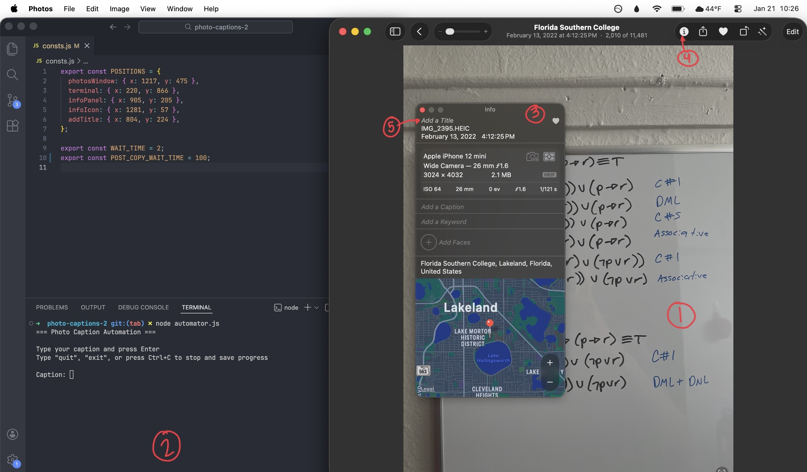

# Photo Captioner

Semi-automates the process of adding captions to photos in Apple Photos using keyboard and mouse automation.

### How It Works

0. Calibrate screen coordinates for your display and window layout
1. Select the first photo in Apple Photos
2. You type the caption in the terminal
3. The script
   - Focuses the photos app
   - Opens in the info panel
   - Types the caption into the caption field
   - Moves to the next photo
4. Progress is saved locally so you can resume later

### Disclaimer

This script uses custom screen coordinates and simulated keyboard and mouse input via [`robotjs`](https://github.com/octalmage/robotjs])

This script is extremely specific and tailored to MY use case. It also can break very easily with any updates Apple may make. Expect some tweaks will need to be made to get it to work with your setup.

**Moving windows, changing display scaling, or switch apps mid-run can (and will) break this script**

### Getting Started

### 1. Clone the Repository

```
git clone https://github.com/aredmondd/photo-captioner.git
```

### 2. Install Dependencies

```
npm install
```

### 3. Open Apple Photos

- Open Photos app
- Navigate to the album (or all of your photos) that you want to caption
- Double click on the first photo you want to process

### 4. Calibration

Before running the automation, you must generate screen coordinates for your setup. Below is a photo of what my setup looks like, with numbers associated to each coordinate item.

You don't have to set up your interface like mine, but you will have to get the coordinates of your custom setup if you are so inclined.

```
node calibrate.js
```

You will be prompted to hover over:

1. Photos window
2. Terminal window
3. Info panel
4. Info icon (ⓘ)
5. Title field

The locations of my coordinates are shown in the image below:



When finished, the script will print a `POSITIONS` object. Copy the output and paste it into `consts.js`

If you have any trouble with the calibration script working, you can always `Command + Shift + 4` to see the current coordinates of your mouse, and paste them in manually to the `consts.js` file.

### 5. Usage

```
node automator.js
```

### Controls & Progress Tracking

- Type a caption in the terminal, and perss Enter to apply it.
- Type `quit` or `exit` to stop safely. `Ctrl + C` to exit unsafely.

Progress is stored in `.photo_progress.json`:

```
{
  "photosCompleted": 120,
  "lastSession": "2026-01-19T19:15:44.684Z",
  "totalPhotos": 12000
}
```

- This file is created automatically
- Delete it or type `n` or `no` at the beginning to avoid this save.

### Notes

- If you're having wierd issues with the captions field not being selected, you can debug quite quickly by setting WAIT_TIME to 500, or 1000 to see what's happening in slow motion.

- If you're having issues with the info icon not being selected all the time, it's probably because your photos window is too small. Make sure the size of the window is large enough so the top right portion of the photos window can display all the icons. If it's too small, it'll look like this, and you won't be able to see the info icon anymore. <br />
  

- Tweaking the WAIT_TIME is a great way to fix most bugs. Sometimes the Apple UI just... doesn't work or load fast enough. I reccomend not going any faster than 20-50ms.
